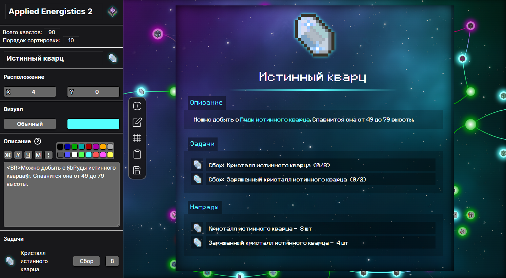

## Редактор квестов мода DwQuests 

**Визуальный редактор для создания и редактирования вкладок с квестами.**
Простой и удобный интерфейс с возможностью использовать весь функционал мода DwQuests.

[dwquests.vercel.app](https://dwquests.vercel.app) | [dwquests.netlify.app](https://dwquests.netlify.app)



## ✨Возможности
-  **Создание или изменение** существующей вкладки квестов

- **Детальное модифицирование** наполнения квестов:
    - название, размер, редкость и расположение
    - описание с полноценным форматированием, включая цвет текста и т.д
    - иконка с возможностью выбрать любой предмет прямо на сайте
    - задачи, награды, зависимости

- **Предпросмотр** итогового квеста

- **Режим редактирования** расположений квестов:
   - перемещение по интерактивному полю
   - выставление ровно по заданной сетке
   - Рисование линий зависимостей между квестами


## ⚙️Использование
1. Создать новую вкладку или импортировать существующую из игры:
    ```sh
    /dwq tab copy <название>
    ```
2. Выполнить редактирование.
3. Выгрузить вкладку и вставить в игру <BR><BR>
    - **Новая вкладка:**
    ```sh
    /dwq tab add <название_вкладки>
    ```
    - **Отредактированная вкладка:**
    ```sh
    /dwq tab paste <название_вкладки>
    ```


## ⚖️Лицензирование
Проект распространяется на условиях лицензии [MIT](LICENSE.md)

---

Благодарности автору мода **DwQuests** - [@SkyDrive94](https://github.com/SkyDrive94)
